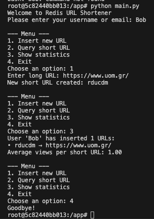
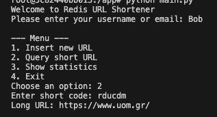

# redis-url-shortener
A simple URL shortener implemented in Python using Redis. Supports insertion, query, and usage statistics tracking.

The application supports:
- Insertion of long URLs (with automatic short code generation)
- Querying short URLs to retrieve the original
- Tracking usage statistics (per-user insertions & average views)

## Setup

Make sure you have [Docker](https://www.docker.com/products/docker-desktop) installed.

```bash
docker compose up --build -d
```
This will start:

- Redis database

- RedisInsight GUI (http://localhost:8001)

- Python application container (for running the app)

## Run the app
Start the CLI app:

```bash
docker exec -it uom-redis-url-shortener-app bash
python app/main.py
```
You’ll be asked for a username, then you can perform actions via the menu.



